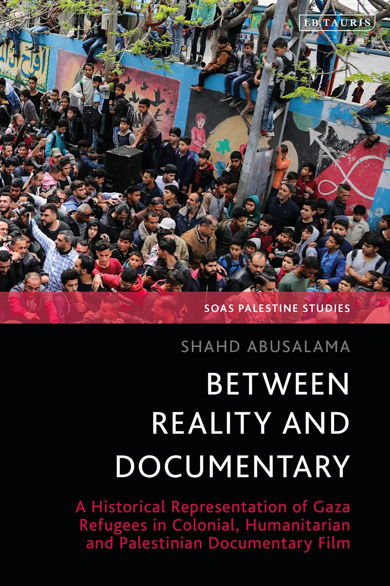
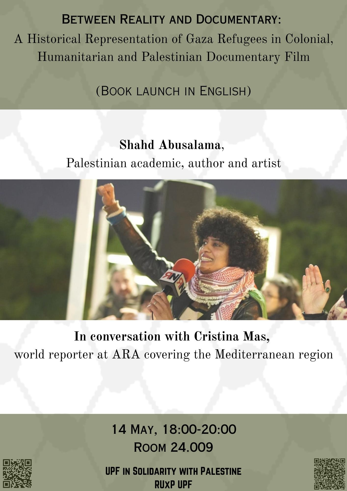

**A book talk by Shahd Abusalama in conversation with Cristina Mas**

**Wednesday, 14 May 2025, at 18:00** 
_(This event was originally planned for 28 April but was rescheduled due to the power outage)_

**Room 24.009** (Located in the [Mercè Rodoreda building](https://www.upf.edu/en/web/campus/merce-rodoreda)) 
**Ciutadella Campus** 
**Universitat Pompeu Fabra**

[Shahd Abusalama](https://palestinefrommyeyes.com) is a Palestinian academic, author and artist, born and raised in Jabalia Refugee Camp, northern Gaza, currently based in Barcelona with her recently displaced family from Gaza. She got a Ph.D. from Sheffield Hallam University which explored the historical representations of Gaza and its refugees in documentary films. Her research is published by Bloomsbury and SOAS Palestine Studies, under the title, [Between Reality and Documentary (2025)](https://www.bloomsbury.com/uk/between-reality-and-documentary-9780755653119/). Dr. Abusalama is also a co-founder of London-based Hawiyya Dance Company which showcases Palestine’s folkloric Dabke and music to UK audiences and beyond to amplify anticolonial and antiracist causes.

Cristina Mas is a world reporter at the Ara newspaper.

Hosted by the [UPF in Solidarity with Palestine collective](https://upfxpalestina.github.io) and the [Red Universitaria por Palestina (RUxP)](https://www.redxpalestina.org).

Directions to the building: [https://www.upf.edu/en/web/campus/merce-rodoreda](https://www.upf.edu/en/web/campus/merce-rodoreda) 
(When you enter you will see signs to room 24.009, which will be on your left.)

Purchase Dr. Abusalama's book: 

 

Download Poster: 

